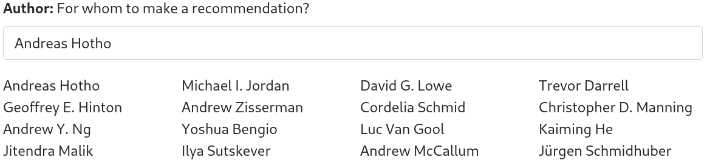
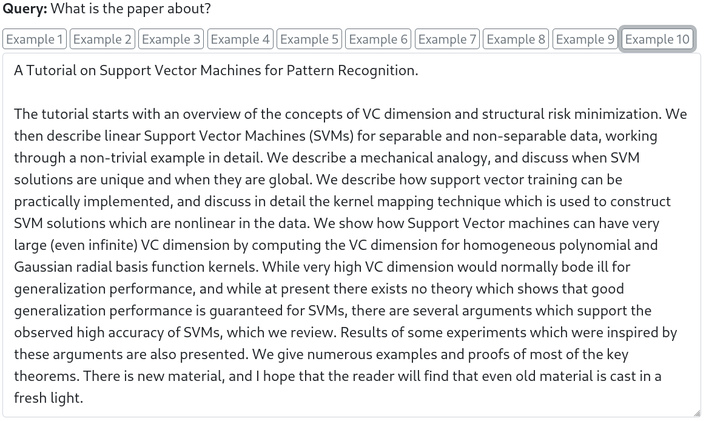
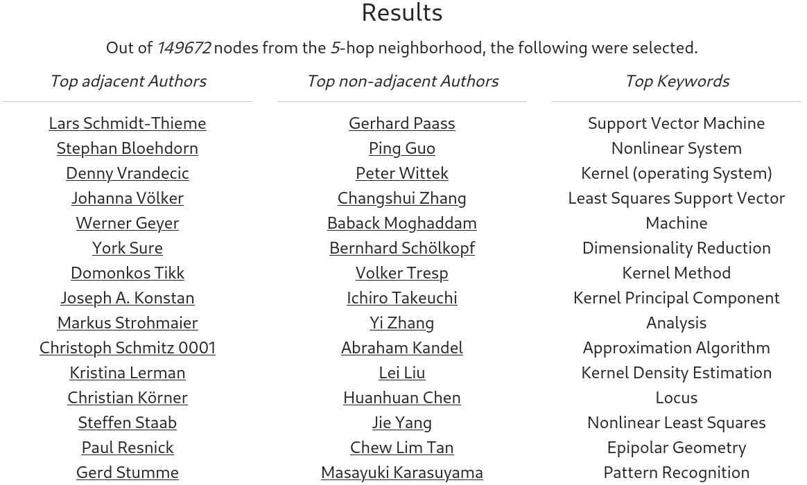
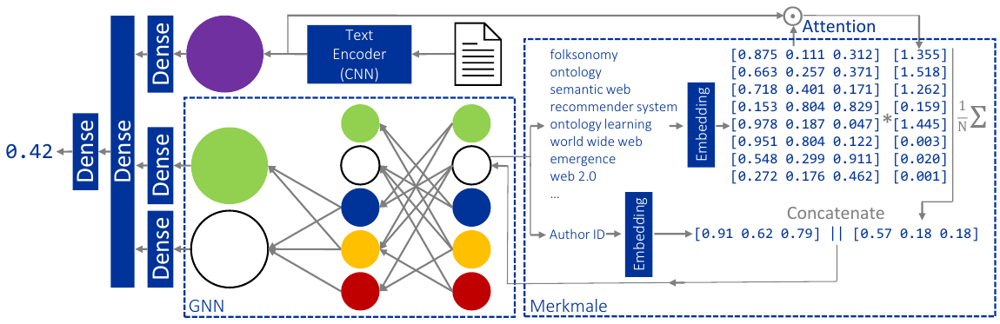

# Graph Neural Networks for Co-Author Recommendation

This application serves a Graph Neural Network trained to provide recommendations for scientific collaborations. 
The basis is a corpus with 265,974 papers, 221,483 unique authors, and 1,614,180 edges between authors. 
The authors can be selected via search, and predictions can be made for all of them. 



It is also necessary to specify what is being collaborated on. 



During training, this was a combination of title and abstract of a paper. 
There are some examples, however, any text can be entered.

Then the application recommends candidates from the 5-hop neighborhood for collaboration. It separately shows candidates with whom the person has already worked and who are completely unknown. The model also allows to implicitly determine keywords of the text, as is described below.



Everything works end-to-end!

# Installation

The easiest way to deploy the application is with the Dockerfile provided.

```
docker build -t gnn4rec .
docker run --rm -it -p 5000:5000 gnn4rec
```

The application can be accessed via **0.0.0.0:5000** with any browser.

You can also install the dependencies locally to run it with Python 3.8:

```
RUN pip install torch-scatter -f https://pytorch-geometric.com/whl/torch-1.8.0+cpu.html
RUN pip install torch-sparse -f https://pytorch-geometric.com/whl/torch-1.8.0+cpu.html
RUN pip install torch==1.8.1 gunicorn==20.1.0 tokenizers==0.10.2 torch-geometric==1.7.0 Flask==2.0.0
gunicorn app:app -b 0.0.0.0:5000
```

# How does this work?
## Dataset

The dataset is based on publications in the artificial intelligence domain extracted from the [Semantic Scholar dataset](https://www.aclweb.org/anthology/N18-3011/). 
The result contains 265,974 publications from 1965 to 2020 with 221,483 different authors. 
There are 1,242,663 undirected edges between authors, i. e., collaborations on different publications. 
About 55 % of authors have only one publication, 71 % have at most two. In addition, 2.1 % of authors have no edge in the graph, i. e., only one solo publication. 
One-sixth of all 2-hop neighbors are also 1-hop neighbors. 
Keywords are associated with 82.7 % of the publications, of which there are 29,287 unique ones in the corpus after simple normalization. 
Each of the publications has a title, and 77.5 % also have an abstract.

## Model



The developed method for recommending collaborations is based on the regression of triples from latent representations of two authors and a text. 
In above figure these are the large circles with green, white and purple color. 
Thus, one person (author 1) first specifies a text to serve as a basis for collaboration. 
During the training, this text consisted of the title and, if available, the abstract. 
Candidates for author 2 are then generated from the *k*-hop neighborhood of author 1. 
A prediction is then made for all triples to recommend those second authors with the highest score.
An arbitrary text encoder, here a Sentence-CNN, first provides the latent representation of the text. 
The representations of the authors are then created by a GNN.
First, the keywords of previous publications of each author are used as features. 
For each keyword, there exists a separate embedding and each author is characterized with at most n words selected by TF-IDF. 
Then, the dot product attention between the text representation and *all* keywords is computed. 
This allows to implicitly learn a tagging system of the texts. 
For each author, the weighted average of their keywords is then formed.
A second embedding is designed to compensate for unobserved factors, such as geographic or social proximity.
This is not available for unknown authors at test time (though it is available for possible neighbors), which can be emulated during training by randomly dropping out entire embedding vectors.
A two-layer message-passing GNN that uses two fully-networked layers each for aggregation and combination then yields the latent author representations.
The major strength over other methods, such as *Bert4Rec*, is that good recommendations can be given even for authors with only one publication. The strength of transformers relies on the context of the sequence. However, the majority of all authors have only one publication and thus a very short sequence, which is where transformers fail.